# Enterprise Operational Architecture (Post-Consolidation)

**Status:** Production architecture  
**Date:** 2026-06-27

---

## Architecture Overview

```mermaid
flowchart TB
  subgraph Frontend["React Frontend (unchanged)"]
    RW[Recruiter Workspace]
    HCT[Hiring Control Tower]
    LegacyUI[Legacy ATS Screens]
  end

  subgraph API["REST API Layer"]
    V1["/api/v1/* Enterprise APIs"]
    Legacy["Legacy Routes /requisitions, /interview-schedules, ..."]
  end

  subgraph Services["Enterprise Services"]
    RS[recruitmentService]
    IS[interviewService]
    TS[taskService]
    OS[offerManagementService]
    WF[workflowService]
    BR[businessRulesService]
  end

  subgraph SoR["Operational System of Record"]
    RM[rm_requisitions]
    RA[rm_recruiter_assignments]
    CM[rm_candidate_mappings]
    II[im_interviews]
    IF[im_feedback]
    ET[et_*]
    WF_T[wf_*]
    OM[om_*]
    AUD[md_enterprise_audit]
    CAND[cand_mstr]
  end

  subgraph Legacy["Deprecated (read-only / rollback)"]
    REQ[req_mstr]
    RRM[req_recruiter_map]
    CRM[candidate_req_map]
    IST[interview_schedule_trn]
    IFH[interview_feedback_hdr/dtl]
  end

  RW --> V1
  HCT --> V1
  LegacyUI --> Legacy

  V1 --> RS
  V1 --> IS
  V1 --> TS
  V1 --> OS
  Legacy --> RS
  Legacy --> IS
  Legacy --> LegacyAdapter[legacyOperationalAdapter]

  RS --> RM
  RS --> RA
  RS --> CM
  IS --> II
  IS --> IF
  TS --> ET
  OS --> OM
  RS --> WF
  IS --> WF
  RS --> AUD
  IS --> AUD

  RS --> CAND
  IS --> CAND

  LegacyAdapter --> RM
  LegacyAdapter --> RA
  LegacyAdapter --> CM
  LegacyAdapter --> II

  Legacy -.->|rollback only| REQ
  Legacy -.-> RRM
  Legacy -.-> CRM
  Legacy -.-> IST
```



---

## Data Flow — Write Path (Post-Cutover)

```
POST /requisition  →  recruitmentLegacyHandlers  →  recruitmentService  →  rm_requisitions
POST /schedule-interview  →  interviewLegacyHandlers  →  interviewService  →  im_interviews
```

Legacy tables are **not** written when `OPERATIONAL_SOR=enterprise` and `LEGACY_DUAL_WRITE=false`.

---

## Data Flow — Read Path

| Consumer | Route | Source |
|----------|-------|--------|
| Recruiter Workspace | `/api/v1/recruitment` | `rm_*` |
| Enterprise Interview UI | `/api/v1/interviews` | `im_*` |
| Legacy ATS screens | `/requisitions`, `/my-requisitions` | `legacyOperationalAdapter` → `rm_*` |
| Task Inbox | `/api/v1/tasks` | `et_*` |
| Offer Governance | `/api/v1/offers` | `om_*` |

---

## Platform Modules (Unchanged)

These remain exactly as designed — no consolidation changes:

- Enterprise Master Data (`md_*`)
- Platform Configuration (`pc_*`)
- Business Rules Engine (`br_*`)
- Workflow Engine (`wf_*`)
- Workforce Planning (`wp_*`)
- Enterprise Task Inbox (`et_*`)
- Enterprise Audit (`md_enterprise_audit`)
- Repository Pattern + Enterprise Store (frontend)
- PostgreSQL + REST APIs

---

## Cutover Control

```
config/operationalCutover.js
├── OPERATIONAL_SOR=enterprise | legacy
└── LEGACY_DUAL_WRITE=true | false
```

Migration service: `services/operationalMigrationService.js`
