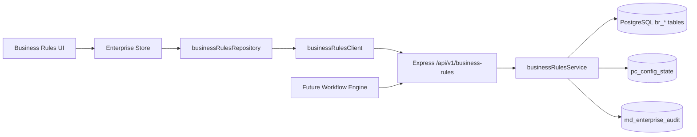

# Business Rules — Rule Execution Flow

This document describes how rules are evaluated, persisted, and audited in production mode.

## Architecture



## Data layers

1. **Draft bundle** — `br_config_state.draft_payload`  
   Edits from UI accumulate locally and in draft JSON until publish.

2. **Published bundle** — `br_config_state.published_payload`  
   Authoritative rules used by evaluation. Loaded into Enterprise Store on bootstrap.

3. **Normalized tables** — `br_rules`, `br_rule_conditions`, `br_rule_actions`, etc.  
   Synced from published bundle on publish/restore/seed for reporting and future workflow integration.

4. **Execution history** — `br_rule_execution_history`  
   Records every execute/simulate call with context and result.

## Publish flow

1. User edits rules in UI → `updateBusinessRulesState` (local draft, dirty flag)
2. User clicks Save → `saveBusinessRules()` → `POST /api/v1/business-rules/publish`
3. Service validates bundle (duplicates, dependencies, conditions)
4. Draft copied to published; version incremented; snapshot created
5. Normalized tables synced; `RulePublished` audit written
6. Store baseline updated; dirty flag cleared

## Single rule execution

```
POST /api/v1/business-rules/execute
{
  "ruleCode": "OFFER_ABOVE_BUDGET",
  "executionContext": {
    "offered_salary_lpa": 22,
    "department": "Engineering",
    "grade": "G10",
    "location": "Bangalore",
    "approved_budget_lpa": 18
  }
}
```

Steps:

1. Load published bundle from `br_config_state`
2. Load platform config budget threshold from `pc_config_state`
3. Resolve approval matrix row by department + grade
4. Evaluate rule conditions via `evaluateRuleDefinition`
5. Return actions, approvals, notifications, escalations
6. Insert `br_rule_execution_history` row
7. Write `RuleExecuted` (+ `RuleMatched` if matched) to `md_enterprise_audit`

## Simulation flow

The UI Rule Simulator (`useBusinessRules.runSimulation`) runs client-side using store data — preserving existing UX without hook changes.

The backend simulate endpoint mirrors this for workflow engine integration:

```
POST /api/v1/business-rules/simulate
{
  "executionContext": {
    "offered_salary_lpa": 18,
    "department": "Engineering",
    "grade": "G10",
    "location": "Bangalore",
    "employment_type": "Full-time"
  }
}
```

Returns:

```json
{
  "triggered_rules": ["Offer Approval Based on Grade"],
  "approvers": ["Hiring Manager", "TA Lead"],
  "notifications": ["Notify TA Leader"],
  "escalations": [],
  "actions": ["Require TA Lead approval"],
  "estimated_sla": "24 hours",
  "budget_threshold_pct": 10
}
```

Writes `RuleSimulationExecuted` audit event.

## Enterprise integration

### Consumes

| Source | Usage |
|--------|-------|
| Platform Configuration | Budget variance threshold, approval chain context |
| Master Data | Grade, department, location codes in execution context (future enrichment) |

### Consumed by (planned)

| Module | Integration |
|--------|-------------|
| Workflow Engine | `POST /execute` on stage transitions |
| Workforce Planning | Budget exception rules |
| Recruitment | Duplicate detection, pipeline rules |
| Hiring Control Tower | Approval matrix + rule detail display |

## Verification scenarios

### 1. Publish a new rule

```bash
# Create draft rule
curl -X POST http://localhost:5000/api/v1/business-rules \
  -H "Authorization: Bearer <token>" \
  -H "Content-Type: application/json" \
  -d '{"name":"Test Rule","category":"Recruitment","trigger_event":"Candidate Created","conditions":["Always"],"actions":["Log event"],"status":"Draft"}'

# Publish bundle from UI or API
curl -X POST http://localhost:5000/api/v1/business-rules/publish \
  -H "Authorization: Bearer <token>" \
  -H "Content-Type: application/json" \
  -d '{"reason":"Verification publish"}'
```

### 2. Execute via simulator API

```bash
curl -X POST http://localhost:5000/api/v1/business-rules/simulate \
  -H "Authorization: Bearer <token>" \
  -H "Content-Type: application/json" \
  -d '{"executionContext":{"offered_salary_lpa":22,"department":"Engineering","grade":"G10","location":"Delhi"}}'
```

### 3. Persist across refresh

1. Enable live mode
2. Publish rules from Business Rules UI
3. Refresh browser
4. Rules remain loaded via bootstrap `GET /api/v1/business-rules`

### 4. Audit verification

```sql
SELECT event_type, entity_id, action, created_on
FROM md_enterprise_audit
WHERE module = 'Business Rules'
ORDER BY created_on DESC
LIMIT 20;
```

### 5. Execution history

```sql
SELECT rule_code, execution_type, matched, executed_on
FROM br_rule_execution_history
ORDER BY executed_on DESC
LIMIT 20;
```

## Rollback

1. `GET /api/v1/business-rules/snapshots`
2. `POST /api/v1/business-rules/restore/:snapshotId`
3. Normalized tables re-synced from restored bundle
