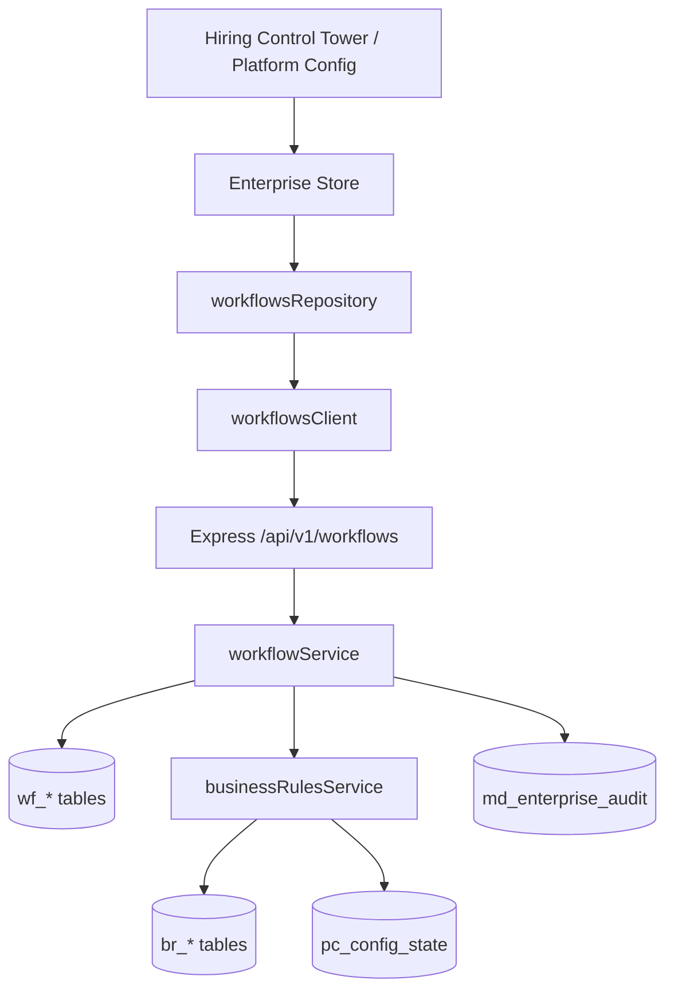

# Enterprise Workflow Engine — Execution Documentation

## Architecture



## Separation of concerns

| Layer | Responsibility |
|-------|----------------|
| Workflow Engine | Stage orchestration, tasks, SLA, history, clarifications |
| Business Rules Engine | Decision evaluation (match, actions, approvals) |
| Platform Configuration | Module toggles, budget thresholds consumed by rules |
| Master Data | Reference data in execution context |

The Workflow Engine passes execution context to the Rules Engine and applies returned actions — it does not duplicate rule logic.

## Execution context

Each instance maintains context including:

- Requisition, candidate, position, department, grade
- Business unit, location, budget, offer details
- Current stage, actor

```json
{
  "requisition": "REQ-2026-1187",
  "candidate": "Ananya Reddy",
  "department": "Engineering",
  "grade": "G10",
  "offered_salary_lpa": 21,
  "approved_budget_lpa": 18,
  "current_stage": "finance_approval",
  "actor": "Anita Desai"
}
```

## Start workflow

```bash
curl -X POST http://localhost:5000/api/v1/workflows/start \
  -H "Authorization: Bearer <token>" \
  -H "Content-Type: application/json" \
  -d '{
    "workflowCode": "REQUISITION",
    "executionContext": {
      "meta": { "requisition_id": "REQ-NEW-001" },
      "department": "Engineering"
    }
  }'
```

Creates `wf_instances` row, initial stage tasks, `wf_history` entry, and `WorkflowStarted` audit.

## Advance workflow

```bash
curl -X POST http://localhost:5000/api/v1/workflows/instances/HCT-2026-00482/advance \
  -H "Authorization: Bearer <token>" \
  -H "Content-Type: application/json" \
  -d '{
    "action": "approve",
    "executionContext": { "stageKey": "finance_approval" }
  }'
```

Steps:

1. Validate instance and stage
2. Apply stage status change
3. Evaluate business rules via `evaluateRulesOnTransition`
4. Append timeline + `wf_history`
5. Advance to next pending stage
6. Write `WorkflowAdvanced` / `StageChanged` audit

## Clarification flow

**Request:**

```bash
POST /api/v1/workflows/instances/HCT-2026-00482/request-clarification
{ "comments": "Please confirm billing rate." }
```

**Submit:**

```bash
POST /api/v1/workflows/instances/HCT-2026-00482/submit-clarification
{ "comments": "Billing rate confirmed at ₹2,400/hr." }
```

## Bootstrap & persistence

On app load with `VITE_API_MODE=live`:

1. `GET /api/v1/workflows` loads definitions + primary instance
2. Enterprise Store receives `workflows`, `hiringProcess`
3. Refresh restores state from PostgreSQL

## Verification scenarios

1. **Publish workflow** — `POST /api/v1/workflows/publish`
2. **Start instance** — `POST /api/v1/workflows/start`
3. **Advance stages** — Approve finance approval via UI or advance API
4. **Clarification** — Request + submit via Hiring Control Tower
5. **Rule evaluation** — Advance on budget stage triggers `Offer Above Budget`
6. **Audit** — Query `md_enterprise_audit` for `WorkflowAdvanced`, `ClarificationRequested`
7. **History** — Query `wf_history` for instance events
8. **Refresh** — Reload app; hiring process stages persist

## Downstream consumers (planned)

- Workforce Planning — budget approval workflows
- Recruitment — candidate pipeline transitions
- Offer Management — offer approval orchestration
- AI Services — advisory hooks at transition points
